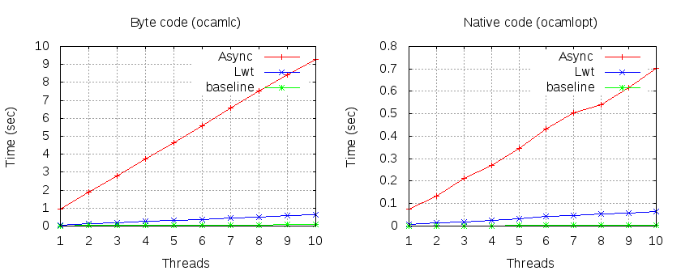
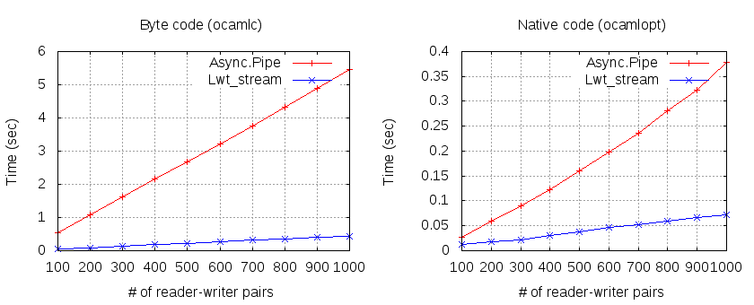

# ocaml-lwt-async-benchmark

A benchmark of [Lwt](https://ocsigen.org/lwt/3.0.0/manual/manual) and [Jane Street Async](https://janestreet.github.io/).

```
omake run -j1
```

## Simple loops

A benchmark of loops that do nothing. This measures overhead of a context switch.

- 1,000,000 times iteration per a thread



## Communication

Communication between two threads: `Async.Pipe` and `Lwt_stream`

- 1,000 times sending and receiving per a thread pair.


